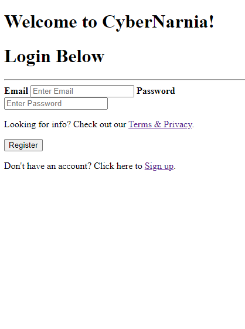

# Cybernarnia

Are you an avid reader? Do you struggle with finding a place to store past, present, and future reads?

Well, look no further because CyberNarnia is here for you! Our application is the prime piece of technology to store all of your bookish needs! In addition, our expansive search engine and saving function, this application is a fantastic combination to save your book history (past, present, or future!)

# User Story

AS A USER who reads.
I WANT to utilize "CyberNarnia" to search and save book titles.
SO THAT I can have a personal log of books to select from based on personal saves & searches.

# Description

A search engine is a progrma that searches for and identifies items in a database that correspond to keywords or characters specified by the user. A user of this application would utilize its functions by searching and saving books to their personal account so that they may read or reference later on in the future.

# Contributors

Steve Carofano, Scott Core, Stephanie Gaston, & Angelica Sargent

# Screenshot

# Link
Check out CyberNarnia [here](https://quiet-hollows-63392.herokuapp.com/)!
